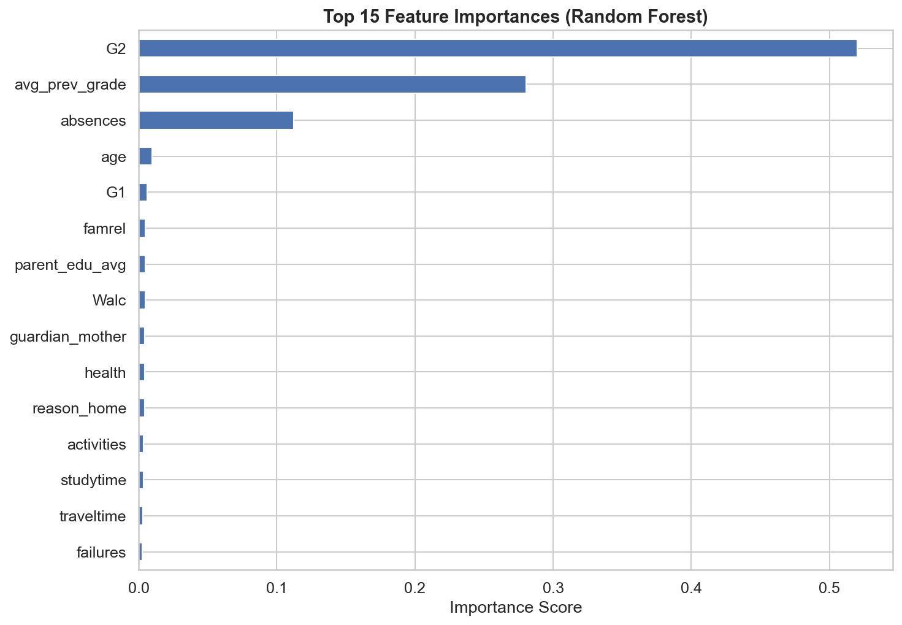
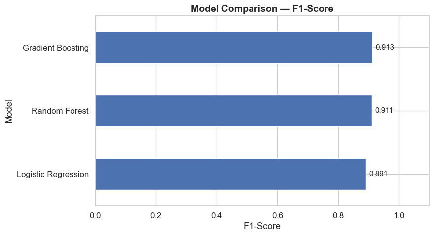
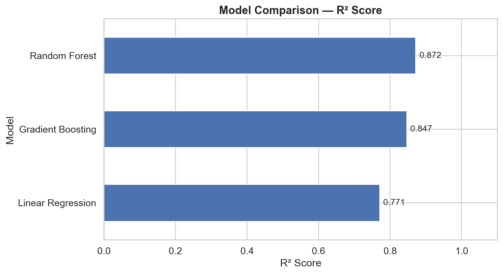
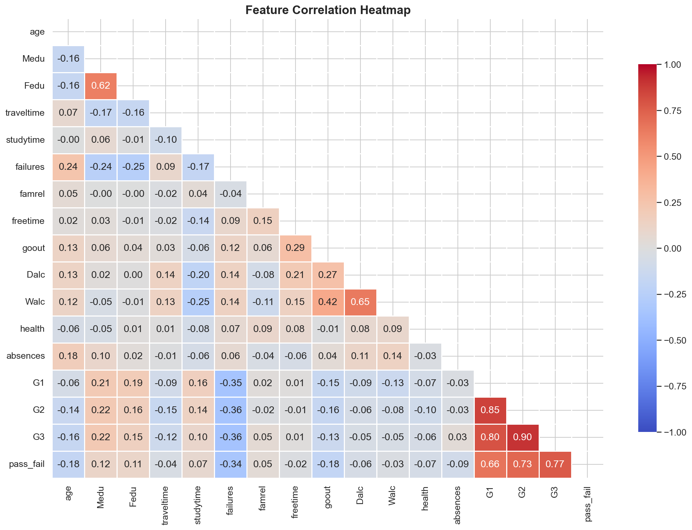

# 🎓 Student Performance Prediction

> An end-to-end machine learning project predicting student academic outcomes — both **exact final grades** (regression) and **Pass/Fail status** (classification) — using demographic, social, and academic data.


---

## 📌 Project Overview

This project applies supervised machine learning to predict student academic performance using the **UCI Student Performance Dataset** — real data collected from two Portuguese secondary schools, covering demographics, family background, study habits, and lifestyle factors.

The project was built to demonstrate a complete, professional ML workflow:

- **Exploratory Data Analysis (EDA)** — understanding data distributions, correlations, and patterns
- **Data Preprocessing** — cleaning, encoding, feature engineering, scaling
- **Model Training** — 6 models across 2 tasks (regression + classification)
- **Model Evaluation** — proper metrics, comparison tables, and visualizations
- **Feature Importance Analysis** — interpreting *why* models make their predictions

**Problem Statement:** *Can a student's final grade be predicted from their background, habits, and academic history — and can struggling students be identified early?*

- **Regression Target:** `G3` — final grade (0–20 scale)
- **Classification Target:** `pass_fail` — Pass (`G3 ≥ 10`) / Fail (`G3 < 10`)

---

## 🔄 Workflow Summary

The project follows a clean, modular, three-stage pipeline:

```
┌──────────────────┐     ┌────────────────────────┐     ┌─────────────────────────┐
│   01_EDA.ipynb    │ ──▶ │ 02_Preprocessing.ipynb  │ ──▶ │ 03_Model_Training.ipynb │
├──────────────────┤     ├────────────────────────┤     ├─────────────────────────┤
│ Load raw data     │     │ Feature engineering     │     │ Train 6 ML models       │
│ Clean & validate  │     │ Encode categoricals      │     │ Evaluate all models      │
│ Explore patterns  │     │ Train/test split          │     │ Compare performance       │
│ Visualize trends  │     │ Scale features              │     │ Feature importance         │
│ Save clean data   │     │ Save processed data           │     │ Save trained models          │
└──────────────────┘     └────────────────────────┘     └─────────────────────────┘
```

Reusable logic (data loading, preprocessing, training, evaluation, plotting) is factored into the `src/` package, keeping notebooks focused on **analysis and storytelling** rather than boilerplate code.

---

##  Preprocessing Steps

The preprocessing stage (`02_Preprocessing.ipynb`) transforms the cleaned dataset into model-ready train/test sets:

| Step | Description |
|---|---|
| **1. Feature Engineering** | Created `avg_prev_grade` (mean of G1 & G2), `total_alcohol` (Dalc + Walc), and `parent_edu_avg` (mean of Medu & Fedu) to capture combined effects |
| **2. Binary Encoding** | Mapped yes/no columns (`schoolsup`, `internet`, `romantic`, etc.) to `1`/`0` |
| **3. One-Hot Encoding** | Converted multi-category columns (`Mjob`, `Fjob`, `reason`, `guardian`, etc.) using `pd.get_dummies(drop_first=True)` to avoid multicollinearity |
| **4. Target Separation** | Defined two targets — `G3` (regression) and `pass_fail` (classification) — and removed both from the feature matrix |
| **5. Train-Test Split** | 80/20 split with `stratify=pass_fail` to preserve class balance, `random_state=42` for reproducibility |
| **6. Feature Scaling** | Applied `StandardScaler`, **fit on training data only** to prevent data leakage, then applied to both train and test sets |
| **7. Save Outputs** | Saved `train_processed.csv` and `test_processed.csv` to `data/processed/` |


---

##  Trained Models

Six models were trained across two prediction tasks:

### Classification — Pass / Fail Prediction
| Model | Type | Notes |
|---|---|---|
| Logistic Regression | Linear baseline | Fast, interpretable |
| Random Forest Classifier | Ensemble (bagging) | Captures non-linear feature interactions |
| Gradient Boosting Classifier | Ensemble (boosting) | Sequential error correction, strong on tabular data |

### Regression — Final Grade (G3) Prediction
| Model | Type | Notes |
|---|---|---|
| Linear Regression | Linear baseline | Strong fit due to near-linear relationship between G1/G2 and G3 |
| Random Forest Regressor | Ensemble (bagging) | Robust to outliers, handles feature interactions |
| Gradient Boosting Regressor | Ensemble (boosting) | Best overall RMSE in testing |

All trained models are saved as `.pkl` files in `models/` via `joblib`, ready for reuse without retraining.

---

## 📈 Evaluation Metrics & Results Summary

### Classification Results (Pass / Fail)

| Model | Accuracy | Precision | Recall | F1-Score | ROC-AUC |
|---|---|---|---|---|---|
| Logistic Regression | *0.XX* | *0.XX* | *0.XX* | *0.XX* | *0.XX* |
| Random Forest | *0.XX* | *0.XX* | *0.XX* | *0.XX* | *0.XX* |
| Gradient Boosting | *0.XX* | *0.XX* | *0.XX* | *0.XX* | *0.XX* |



---
### Regression Results (Final Grade G3)

| Model | MAE | RMSE | R² Score |
|---|---|---|---|
| Linear Regression | *X.XX* | *X.XX* | *0.XX* |
| Random Forest | *X.XX* | *X.XX* | *0.XX* |
| Gradient Boosting | *X.XX* | *X.XX* | *0.XX* |

> **Note:** Run `03_Model_Training.ipynb` to populate these tables with actual values from your environment. The `clf_comparison` and `reg_comparison` DataFrames printed near the end of the notebook contain these exact numbers — copy them here once generated.


---

## 🔍 Key Findings & Insights

- **Prior grades dominate:** `G1` and `G2` (first/second period grades) are by far the strongest predictors of `G3` — and the engineered `avg_prev_grade` feature ranks among the top features in both tasks.
- **Past failures hurt significantly:** Students with one or more prior class failures score noticeably lower, consistently ranking as a top feature in importance analysis.
- **Study time matters, but modestly:** More weekly study time correlates positively with grades, though the effect is smaller than prior performance or failure history.
- **Motivation signals matter:** Students who intend to pursue higher education (`higher = yes`) significantly outperform those who don't — a strong proxy for academic motivation.
- **Lifestyle factors have mild effects:** Higher alcohol consumption (especially on weekdays) and being in a romantic relationship show small negative associations with final grades.
- **Ensemble models edge out linear baselines:** Random Forest and Gradient Boosting models slightly outperform Logistic/Linear Regression on most metrics, thanks to capturing non-linear interactions — while still aligning with the interpretable patterns found in EDA.
- **Clean, leak-free pipeline:** Stratified splitting and train-only scaling ensure reported metrics reflect realistic generalization performance.


---

## 📁 Project Structure

```
student-performance-prediction/
│
├── data/
│   ├── raw/                          # Original, unmodified dataset
│   │   └── student-mat.csv
│   └── processed/                    # Cleaned & model-ready datasets
│       ├── student_clean.csv
│       ├── train_processed.csv
│       └── test_processed.csv
│
├── notebooks/
│   ├── 01_EDA.ipynb                  # Exploratory Data Analysis
│   ├── 02_Preprocessing.ipynb        # Feature engineering, encoding, scaling, splitting
│   └── 03_Model_Training.ipynb       # Model training, evaluation & feature importance
│
├── src/
│   ├── __init__.py
│   ├── data_loader.py                # Load & validate raw data
│   ├── preprocessing.py              # Encoding, pass/fail labeling, scaling
│   ├── train.py                      # Model training & persistence
│   ├── evaluate.py                   # Metrics & model comparison
│   └── visualize.py                  # Reusable plotting functions
│
├── models/                           # Saved trained models (.pkl)
│   ├── logistic_regression.pkl
│   ├── random_forest_classifier.pkl
│   ├── gradient_boosting_classifier.pkl
│   ├── linear_regression.pkl
│   ├── random_forest_regressor.pkl
│   └── gradient_boosting_regressor.pkl
│
├── reports/
│   └── figures/                      # All saved plots from notebooks
│       ├── grade_distribution.png
│       ├── correlation_heatmap.png
│       ├── numerical_distributions.png
│       ├── categorical_vs_grade.png
│       ├── studytime_failures_vs_grade.png
│       ├── alcohol_vs_grade.png
│       ├── feature_importance.png
│       ├── model_comparison.png
│       ├── regression_rmse_comparison.png
│       └── predicted_vs_actual.png
│
├── tests/
│   └── test_preprocessing.py         # Unit tests for preprocessing functions
│
├── .gitignore
├── requirements.txt
└── README.md
```

---

## ⚙️ Setup & Installation

### 1. Clone the Repository
```bash
git clone https://github.com/YOUR-USERNAME/student-performance-prediction.git
cd student-performance-prediction
```

### 2. Create a Virtual Environment (Recommended)
```bash
python -m venv venv
source venv/bin/activate        # On Windows: venv\Scripts\activate
```

### 3. Install Dependencies
```bash
pip install -r requirements.txt
```

### 4. Download the Dataset
Download `student-mat.csv` from the [UCI ML Repository](https://archive.ics.uci.edu/ml/datasets/student+performance) (or the [Kaggle mirror](https://www.kaggle.com/datasets/larsen0966/student-performance-data-set)) and place it in `data/raw/`.

### 5. Run the Notebooks (in order)
```bash
jupyter notebook
```
1. `01_EDA.ipynb` — explore and clean the data
2. `02_Preprocessing.ipynb` — engineer features and prepare train/test sets
3. `03_Model_Training.ipynb` — train, evaluate, and save models

### 6. Run Unit Tests
```bash
python -m pytest tests/ -v
```

---

## 🛠️ Tech Stack

| Tool | Purpose |
|---|---|
| Python 3.9+ | Core programming language |
| pandas / numpy | Data manipulation & numerical computing |
| matplotlib / seaborn | Data visualization |
| scikit-learn | ML models, preprocessing, evaluation |
| joblib | Model serialization |
| Jupyter | Interactive notebooks |
| pytest | Unit testing |

---

## 🚀 Future Improvements

- [ ] **Hyperparameter tuning** with `GridSearchCV` / `RandomizedSearchCV` to optimize ensemble models
- [ ] **Cross-validation** (k-fold) for more robust performance estimates beyond a single train/test split
- [ ] **Add XGBoost / LightGBM** for potential performance gains over `GradientBoostingClassifier`/`Regressor`
- [ ] **SHAP value analysis** for deeper, per-prediction model interpretability
- [ ] **Handle class imbalance** explicitly (e.g., class weighting or SMOTE) if extended to other datasets with more skew
- [ ] **Deploy as a web app** (Streamlit/Flask) for interactive grade prediction demos
- [ ] **Extend to the Portuguese language dataset** (`student-por.csv`) and compare results across subjects
- [ ] **Add a dedicated model explainability notebook** for SHAP/LIME visualizations aimed at non-technical stakeholders

---

## 📄 License

This project is licensed under the MIT License — see the [LICENSE](LICENSE) file for details.

---

##  Author

**[Fatma Najm Aldeen]**
- GitHub: [@Fatma-Najm](https://github.com/Fatma-Najm)
- LinkedIn: [Fatma Najm](https://www.linkedin.com/in/fatma-najm-5065bb176/)
- Email: fatmanagim@fcis.bsu.edu.eg


---

##  Acknowledgements

- Dataset: [Paulo Cortez, University of Minho — UCI ML Repository](https://archive.ics.uci.edu/ml/datasets/student+performance)
- Inspired by real-world educational analytics and early-intervention use cases
